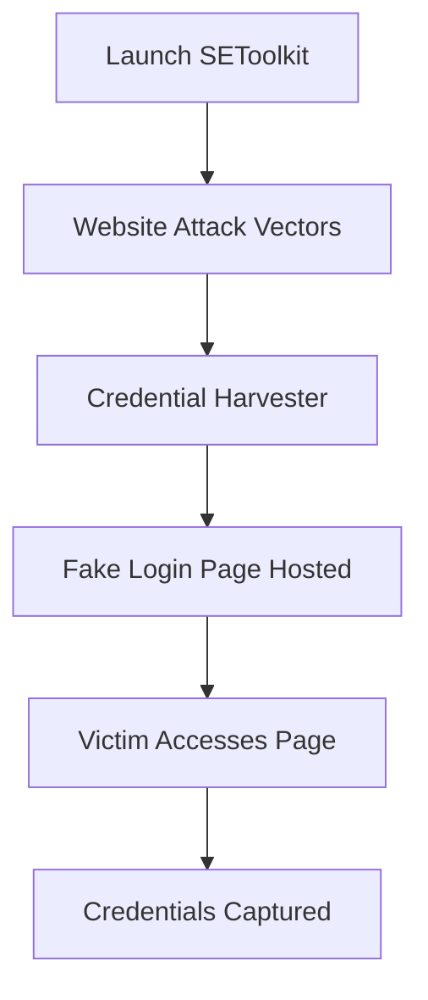
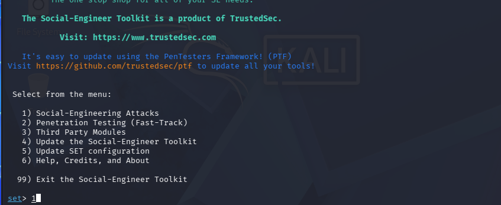
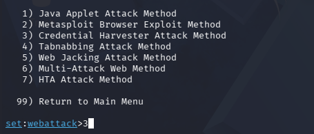
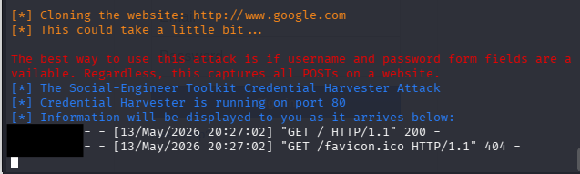
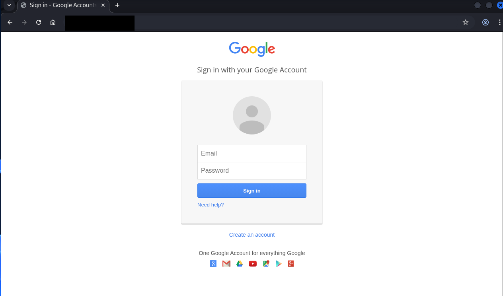
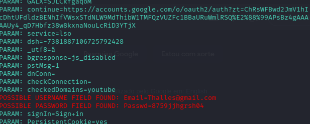

# 🎣 Phishing Simulation with SEToolkit

### *Educational Credential Harvester Lab — Kali Linux*

<p align="center">


</p>

---

# 📖 About The Project

This project demonstrates a **phishing attack simulation** using the **Social-Engineer Toolkit (SET)** on **Kali Linux** in a controlled lab environment.

The objective was to understand how attackers use **social engineering techniques** to clone websites and capture credentials, helping improve cybersecurity awareness and defensive strategies.

---

# ⚠️ Disclaimer

> This repository was created strictly for educational and ethical cybersecurity training purposes.

Phishing attacks performed without authorization are illegal.

This simulation was executed only in a controlled laboratory environment using test credentials and virtual machines.

---

# 🎯 Objectives

✔️ Understand social engineering attack workflows
✔️ Simulate credential harvesting techniques
✔️ Learn how phishing pages are hosted locally
✔️ Explore the Social-Engineer Toolkit (SET)
✔️ Improve awareness of phishing-based attacks

---

# 🛠️ Technologies & Tools

| Tool                    | Purpose                         |
| ----------------------- | ------------------------------- |
| 🐉 Kali Linux           | Penetration testing OS          |
| 🎭 SEToolkit            | Social engineering framework    |
| 💻 Oracle VirtualBox    | Virtualized lab environment     |
| 🌐 Apache/Python Server | Local hosting for phishing page |

---

# 🧠 Attack Workflow



---

# ⚙️ Lab Steps

## 1️⃣ Gain Root Privileges

```bash
sudo su
```

---

## 2️⃣ Start SEToolkit

```bash
setoolkit
```

---

## 3️⃣ Navigate Through SEToolkit

```text
1 → Social-Engineering Attacks
2 → Website Attack Vectors
3 → Credential Harvester Attack Method
2 → Web Templates
```

---

## 4️⃣ Select Web Template

Template used:

```text
Google
```

The phishing page was hosted locally on the Kali Linux machine.

---

## 5️⃣ Obtain Local IP Address

```bash
ifconfig
```

Used to identify the machine IP for local network access during the simulation.

---

# 📸 Screenshots

## 🖥️ SEToolkit Main Menu



---

## 🎭 Credential Harvester Options



---

## 🌐 Template Running



---

## 🔐 Fake Google Login Page



---

## 📥 Captured Credentials

> Only fake/test credentials were used.



---

# 🔍 Key Learnings

* How phishing attacks operate in practice
* Difference between **Web Templates** and **Site Cloner**
* Importance of URL verification
* Local hosting techniques used in phishing simulations
* Basic usage of Social-Engineer Toolkit
* Ethical responsibility in offensive security

---

# 🛡️ Security Awareness

This project reinforces important security concepts:

* Multi-Factor Authentication (MFA)
* URL verification
* Browser security indicators
* Email phishing detection
* Security awareness training

---

# ⚖️ Ethical Considerations

This project should only be reproduced in:

* Authorized penetration tests
* Educational labs
* Cybersecurity training environments

❌ Never use these techniques against real users or systems without explicit permission.

Phishing is illegal in Brazil and in most countries.

---

# 🎓 Academic Context

Developed during my cybersecurity learning journey.

* 🎓 Cybersecurity Specialist Formation — DIO.me
* 🎓 MIT Postgraduate Program in Cyber Security — SENAI

---

# 🚀 Future Improvements

* Add custom phishing templates
* Simulate email delivery scenarios
* Integrate logging analysis
* Study phishing detection mechanisms
* Create awareness training examples

---

# 👩‍💻 Author

Developed with dedication during my cybersecurity studies 💙

---

# ⭐ Support

If you found this project interesting, feel free to:

⭐ Star the repository
🍴 Fork for educational purposes
📚 Use responsibly in lab environments

---

# 📄 License

This repository is intended for educational use only.

---

# 💙 Personal Note

This is my first cybersecurity project published on GitHub.

It may be simple, but it represents the beginning of my journey in ethical hacking and cybersecurity studies.

My goal is to understand offensive security techniques in order to help improve defense, awareness, and prevention.

Learning step by step 🚀
